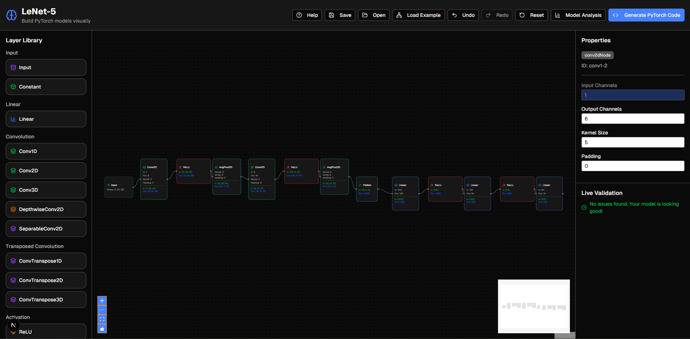

# PyTorch Neural Network Designer

An interactive visual tool for designing, analyzing, and exporting PyTorch neural network models directly in your browser.

Built with the help of v0.app, Claude and Gemini.



## Overview

This application provides a powerful drag-and-drop interface that allows users to build complex neural network architectures by connecting different layers on a canvas. It's designed to help both beginners and experts quickly prototype models, understand their structure, and catch potential issues before writing any code. Once a model is designed, the application can generate the corresponding PyTorch code.

## Key Features

-   **Visual Model Building:** Drag, drop, and connect nodes to build your network architecture.
-   **Rich Layer Library:** A wide range of PyTorch layers are supported, including:
    -   Core layers (Linear, Conv2D, Pooling, Dropout)
    -   Activation functions (ReLU, Sigmoid, Tanh, etc.)
    -   Normalization layers (BatchNorm, LayerNorm)
    -   Advanced layers (LSTM, GRU, Transformers)
-   **Real-time Shape Propagation:** Automatically calculates and displays the output tensor shape for each layer as you build.
-   **Model Validation:** Checks for common errors such as shape mismatches, disconnected nodes, and cycles.
-   **Code Generation:** Export your visual model to clean, readable PyTorch code.
-   **Model Importer:** Paste existing PyTorch model code to visualize it on the canvas.
-   **Save, Load, Import & Export:** Save models to your browser's local storage, or export/import them as `.json` files to share and back up your work.
-   **Model Analysis:** Get insights into your model's complexity, including total parameters, FLOPs, and estimated memory usage.
-   **Example Library:** Load and explore pre-built models like LeNet-5, ResNet, U-Net, and YOLO to learn common architectures.

## Tech Stack

-   **Framework:** [Next.js](https://nextjs.org/)
-   **Language:** [TypeScript](https://www.typescriptlang.org/)
-   **UI:** [React](https://reactjs.org/)
-   **Styling:** [Tailwind CSS](https://tailwindcss.com/)
-   **Flow/Canvas:** [@xyflow/react](https://reactflow.dev/)
-   **Package Manager:** [pnpm](https://pnpm.io/)

## Getting Started

To run the project locally, follow these steps:

1.  **Clone the repository:**
    ```bash
    git clone https://github.com/pmquang87/v0-pytorch-neural-network-designer.git
    cd v0-pytorch-neural-network-designer
    ```

2.  **Install dependencies:**
    This project uses `pnpm` as its package manager.
    ```bash
    pnpm install
    ```

3.  **Run the development server:**
    ```bash
    pnpm run dev
    ```

4.  **Open the application:**
    Open [http://localhost:3000](http://localhost:3000) in your browser to see the application running.

## Contributing

Contributions are welcome! If you have suggestions for improvements or find a bug, please feel free to open an issue or submit a pull request.

### Contribution Workflow

1.  Fork the repository.
2.  Create a new branch for your feature or bug fix (`git checkout -b feat/my-new-feature` or `git checkout -b fix/my-bug-fix`).
3.  Make your changes.
4.  Commit your changes (`git commit -m 'feat: Add some amazing feature'`).
5.  Push to the branch (`git push origin feat/my-new-feature`).
6.  Open a pull request.

For major changes, please open an issue first to discuss what you would like to change.
